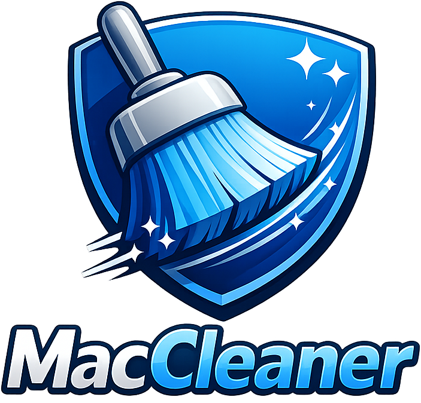

<p align="center">
  
</p>

# MacCleaner

MacCleaner é um aplicativo desktop para macOS, feito em Flutter, para encontrar arquivos que podem ser candidatos à limpeza, como caches, logs, downloads temporários, itens da Lixeira, arquivos grandes, duplicados, caches de ferramentas de desenvolvimento, resíduos de apps e fontes duplicadas.

O projeto é construído como um app Flutter nativo para macOS, com interface inspirada no macOS, gerenciamento de estado com Riverpod, rotas com GoRouter e uma pequena ponte nativa em Swift para mover arquivos para a Lixeira.

## Estado Atual

Este projeto está em desenvolvimento ativo. O app já compila e executa no macOS, faz varreduras reais no sistema de arquivos, move itens selecionados para a Lixeira e exporta logs de varredura em modo debug para revisão. A lógica de limpeza ainda deve ser tratada como experimental até que as regras de segurança e os testes sejam expandidos.

Verificado localmente:

```bash
flutter analyze
flutter build macos
```

## Aviso de Segurança

O MacCleaner analisa arquivos reais no seu computador. Tenha cuidado antes de apagar qualquer item.

Recomendações durante os testes:

- Prefira "Mover para Lixeira" em vez de deletar permanentemente.
- Revise os arquivos selecionados antes de limpar.
- Evite apagar caches de desenvolvimento ou resíduos de apps se você não entende o impacto.
- Mantenha backup dos seus projetos e dados importantes.
- Não trate itens detectados como "resíduos" ou "duplicados" como garantidamente seguros até que as regras sejam reforçadas e cobertas por testes.

Algumas categorias podem afetar ferramentas de desenvolvimento, simuladores, gerenciadores de pacotes, dados do Docker, caches de build ou preferências de aplicativos.

## Funcionalidades

- Layout desktop inspirado no macOS, com barra de título customizada e sidebar.
- Dashboard com resumo de uso do disco.
- Fluxos de varredura rápida e completa.
- Checkboxes no Dashboard que controlam quais categorias serão varridas.
- Resultados organizados por categoria.
- Filtro e ordenação de arquivos na tela de resultados.
- Controles de seleção por categoria e por arquivo.
- Modal de confirmação antes da limpeza.
- Integração nativa com a Lixeira do macOS via `NSWorkspace.recycle`.
- Tela de configurações para limites de varredura e caminhos excluídos.
- Exportação de log CSV somente em modo debug, com ação para revelar no Finder.
- Ícone nativo e nome do bundle configurados como MacCleaner.

## Categorias de Varredura

O MacCleaner atualmente inclui suporte para:

- Caches do sistema
- Logs do sistema e de aplicativos
- Arquivos temporários
- Lixeira do usuário
- Caches de desenvolvimento e aplicativos
- Arquivos grandes
- Arquivos duplicados
- Resíduos de aplicativos
- Fontes duplicadas

Nem todas as categorias estão prontas para uso em produção. Algumas regras de detecção são conservadoras na interface, mas o scanner ainda precisa de validações mais fortes antes de ser usado como ferramenta de limpeza real.

## Stack Técnica

- Flutter 3.22+ para desktop macOS
- Dart 3.4+
- Riverpod 2 com geração de código
- GoRouter
- Material 3
- `window_manager`
- Ponte nativa macOS via `MethodChannel`
- Organização em pastas inspirada em Clean Architecture

## Estrutura do Projeto

```text
lib/
  app/
    app.dart
    router.dart
    theme.dart
  core/
    constants/
    errors/
    utils/
  features/
    dashboard/
    scanner/
    results/
    report/
    settings/
macos/
  Runner/
```

## Requisitos

- macOS 12 Monterey ou superior
- Flutter stable
- Xcode com suporte a desenvolvimento desktop para macOS
- CocoaPods para dependências de plugins macOS

Verifique seu ambiente Flutter:

```bash
flutter doctor
flutter config --enable-macos-desktop
```

## Como Começar

Instale as dependências:

```bash
flutter pub get
```

Gere os arquivos do Riverpod, se necessário:

```bash
dart run build_runner build --delete-conflicting-outputs
```

Execute o app:

```bash
flutter run -d macos
```

Gere uma build release:

```bash
flutter build macos
```

O bundle release é gerado em:

```text
build/macos/Build/Products/Release/MacCleaner.app
```

## Verificações de Desenvolvimento

Rode a análise estática:

```bash
flutter analyze
```

Rode os testes:

```bash
flutter test
```

Observação: os testes unitários para os casos de uso do scanner e para a proteção de deleção ainda precisam ser implementados.

## Permissões no macOS

O app macOS está configurado para um modelo de distribuição direta, com sandbox desativado nos entitlements. O app também inclui descrições de uso para acesso às pastas Documentos, Downloads e Mesa em `macos/Runner/Info.plist`.

Para distribuição pela Mac App Store, o modelo de permissões precisaria mudar para uma abordagem compatível com sandbox, como acesso selecionado pelo usuário e security-scoped bookmarks.

## Limitações Conhecidas

- Operações pesadas de varredura ainda não usam `Isolate.run` ou `compute`.
- A segurança de deleção precisa de normalização de paths mais robusta e cobertura de testes.
- Deleção permanente precisa de confirmação mais rígida.
- Parte da tela de configurações ainda não está conectada a automações reais do macOS.
- A detecção de resíduos de apps deve usar bundle IDs em vez de comparação aproximada por nome.
- A detecção de fontes duplicadas deve usar metadados da fonte, não nomes de arquivo.
- O cálculo de hash para duplicados deve sair do isolate principal da UI.
- Testes automatizados ainda não foram implementados.

## Roadmap

Segurança e correção:

- Adicionar testes unitários para segurança de deleção e casos de uso do scanner.
- Reforçar as regras de limpeza por categoria.
- Tornar a deleção permanente opcional e protegida por dupla confirmação.
- Manter categorias arriscadas desmarcadas por padrão, especialmente resíduos de apps, fontes duplicadas, Docker, Android AVDs e dados de simuladores.
- Adicionar um relatório de simulação explicando por que cada item é considerado seguro ou arriscado.
- Adicionar allowlists e blocklists específicas por categoria.
- Adicionar canonicalização de paths e verificações seguras para symlinks.

Motor de varredura:

- Melhorar cancelamento de varredura e precisão do progresso.
- Mover varreduras recursivas e cálculo de hash para isolates.
- Melhorar detecção de duplicados com hashing em etapas e verificação contra colisões.
- Detectar fontes duplicadas usando metadados da fonte em vez de nomes de arquivo.
- Melhorar a qualidade da detecção de duplicados e resíduos.
- Detectar resíduos de apps usando bundle IDs dos aplicativos instalados.
- Melhorar regras para Docker, simuladores, Gradle, Maven, Homebrew e caches Android.

Experiência do usuário:

- Adicionar histórico persistente de limpezas.
- Adicionar uma tela de revisão agrupada por nível de risco.
- Adicionar ação "Revelar no Finder" para itens individuais da varredura.
- Adicionar exportação CSV em builds release, não apenas logs debug.
- Adicionar busca por caminho, categoria e nível de risco.
- Melhorar estados vazios, carregando, erro e permissões parciais.
- Adicionar feedback mais claro após a limpeza, incluindo arquivos ignorados e falhas ao mover.

Configurações e automação:

- Implementar inicialização ao login com LaunchAgent real ou integração de login item do macOS.
- Implementar varreduras automáticas semanais.
- Persistir configurações do usuário com `shared_preferences` ou SQLite.
- Adicionar edição de caminhos excluídos com seletor de pasta do Finder.
- Adicionar limites por categoria para idade e tamanho dos arquivos.

Distribuição:

- Adicionar fluxo de assinatura e notarização do app.
- Preparar build `.dmg` para download direto.
- Investigar uma variante compatível com a Mac App Store usando security-scoped bookmarks.
- Adicionar CI para análise, testes e builds macOS.

